# Postman Outputs (short summary)

This file transcribes the key Postman request/response outputs visible in the provided screenshots.

## Auth

- POST `/api/auth/register/` (request)

```json
{
  "name": "Sairaj Jadhav",
  "email": "sairaj@example.com",
  "password": "Password@123"
}
```

(response, 201 Created)

```json
{
  "message": "User registered successfully.",
  "user": { "id": 2, "name": "Sairaj Jadhav", "email": "sairaj@example.com" }
}
```

- POST `/api/auth/login/` (request)

```json
{
  "email": "sairaj@example.com",
  "password": "Password@123"
}
```

(response, 200 OK — tokens truncated)

```json
{
  "message": "Login successful.",
  "tokens": {
    "access": "eyJhbGciOi...", 
    "refresh": "eyJhbGciOi..."
  },
  "user": { "id": 2, "name": "Sairaj Jadhav", "email": "sairaj@example.com" }
}
```

## Patients

- POST `/api/patients/` (create sample shown in screenshot)

```json
{
  "name": "John Doe",
  "age": 30,
  "gender": "Male",
  "phone": "9876543210",
  "address": "Pune"
}
```

(GET `/api/patients/` response — list view from screenshots)

```json
[
  {
    "id": 3,
    "name": "Sairaj Jadhav",
    "age": 30,
    "gender": "Male",
    "phone": "9876543210",
    "address": "Pune",
    "medical_history": "",
    "created_at": "2026-07-07T10:33:08.683412Z",
    "updated_at": "2026-07-07T10:33:08.683427Z"
  },
  {
    "id": 2,
    "name": "Sairaj Jadhav",
    "age": 30,
    "gender": "Male",
    "phone": "9876543210",
    "address": "Pune",
    "medical_history": "",
    "created_at": "2026-07-07T10:32:29.816668Z",
    "updated_at": "2026-07-07T10:32:29.816700Z"
  }
]
```

- PUT `/api/patients/2/` (update sample from screenshot)

```json
{
  "name": "ShahRukh Khan",
  "age": 15,
  "gender": "Male"
}
```

(response, 200 OK — updated patient)

```json
{
  "id": 2,
  "name": "ShahRukh Khan",
  "age": 15,
  "gender": "Male",
  "phone": "9876543210",
  "address": "Pune",
  "medical_history": "",
  "created_at": "2026-07-07T10:32:29.816668Z",
  "updated_at": "2026-07-07T10:41:19.525263Z"
}
```

- DELETE `/api/patients/2/` (response from screenshot)

```json
{ "message": "Patient record deleted successfully." }
```

## Doctors

- POST `/api/doctors/` (create sample)

```json
{
  "name": "Dr. Rahul Sharma",
  "specialization": "Cardiologist",
  "phone": "9876543211",
  "email": "rahul@example.com"
}
```

(response, 201 Created)

```json
{
  "id": 2,
  "name": "Dr. Rahul Sharma",
  "specialization": "Cardiologist",
  "email": "rahul@example.com",
  "phone": "9876543211",
  "created_at": "2026-07-07T10:49:20.790827Z",
  "updated_at": "2026-07-07T10:49:20.790844Z"
}
```

- GET `/api/doctors/` (response shown)

```json
[
  {
    "id": 2,
    "name": "Dr. Rahul Sharma",
    "specialization": "Cardiologist",
    "email": "rahul@example.com",
    "phone": "9876543211"
  },
  {
    "id": 1,
    "name": "Dr. Smith",
    "specialization": "Cardiology",
    "email": "smith@hospital.com",
    "phone": "9876543210"
  }
]
```

- DELETE `/api/doctors/2/` (response)

```json
{ "message": "Doctor record deleted successfully." }
```

## Mappings

- GET `/api/mappings/` (response — nested patient + doctor entry shown)

```json
[
  {
    "id": 1,
    "patient": {
      "id": 1,
      "name": "John Doe",
      "age": 35,
      "gender": "Male",
      "medical_history": "Diabetes Type 2"
    },
    "doctor": {
      "id": 1,
      "name": "Dr. Smith",
      "specialization": "Cardiology",
      "email": "smith@hospital.com"
    },
    "created_at": "2026-07-07T09:52:12.890176Z"
  }
]
```

---

Notes:
- Token strings are intentionally truncated in this summary for security.
- Timestamps and `id` values are transcribed from screenshots and may differ between runs.

## Images

Embedded screenshots from the `postman Outputs` folder (as found in the workspace).

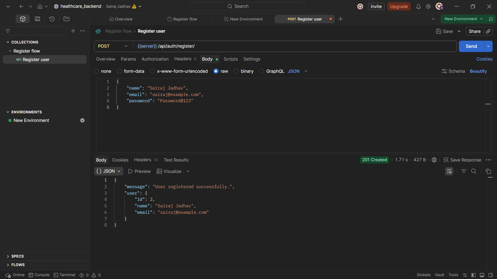

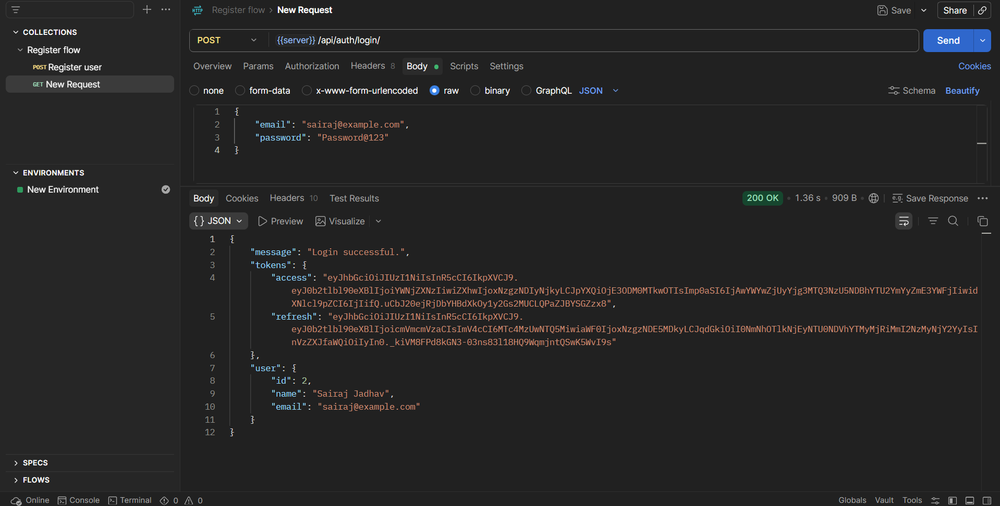

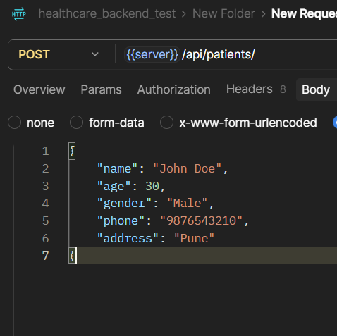

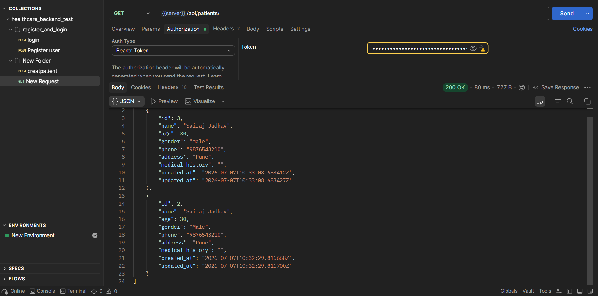

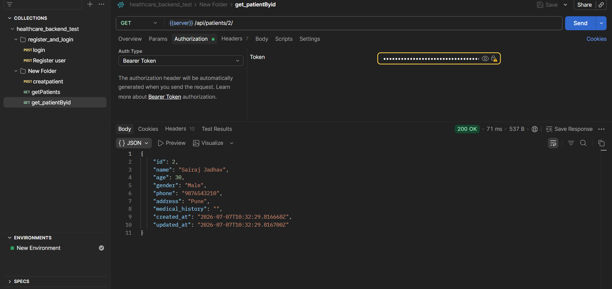

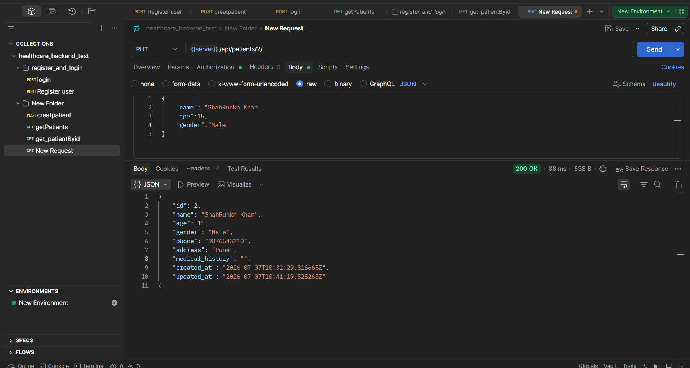

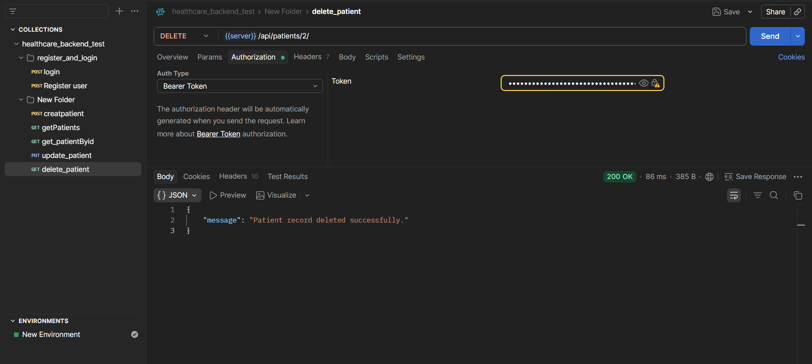

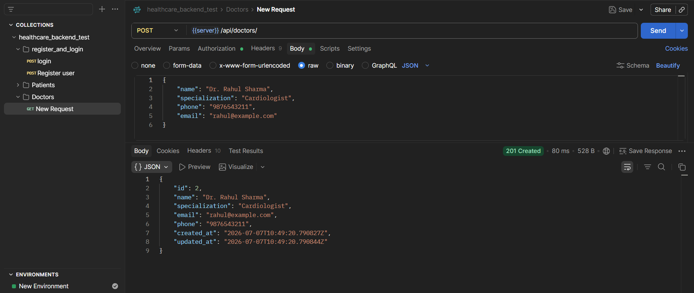

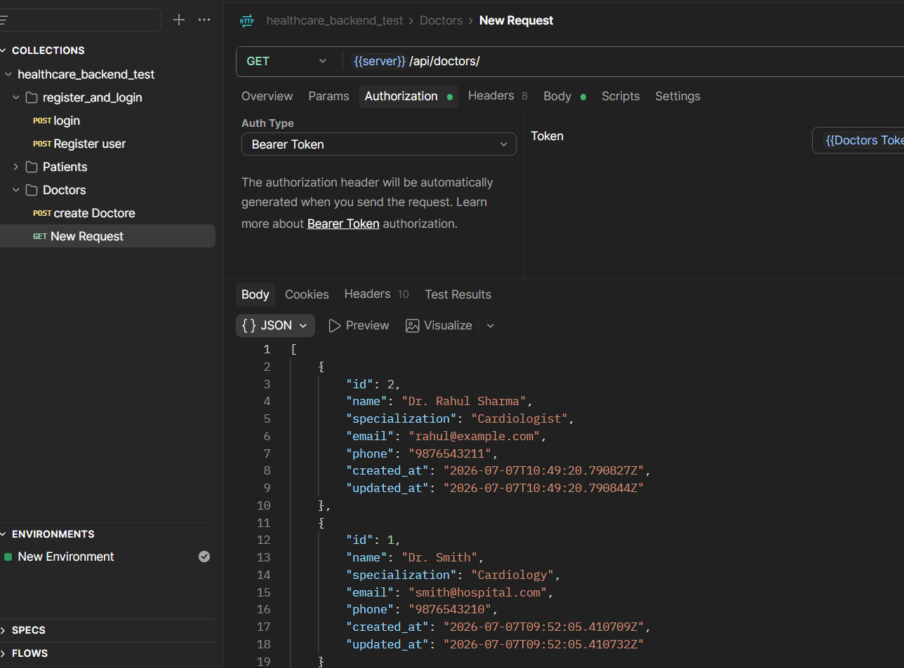

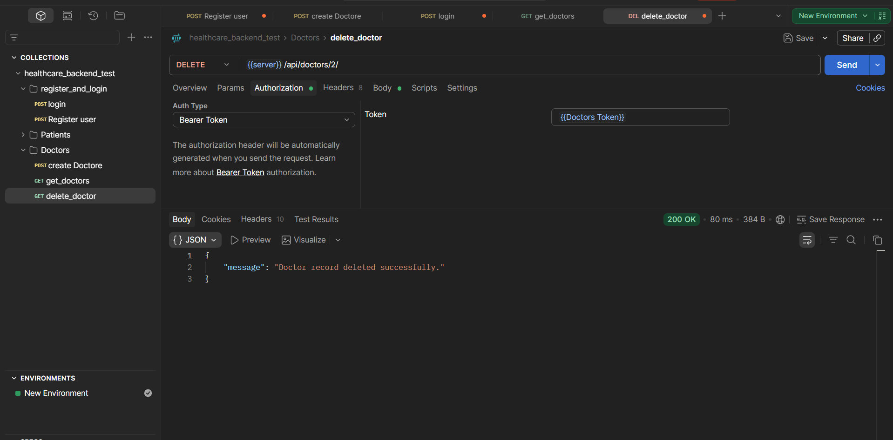

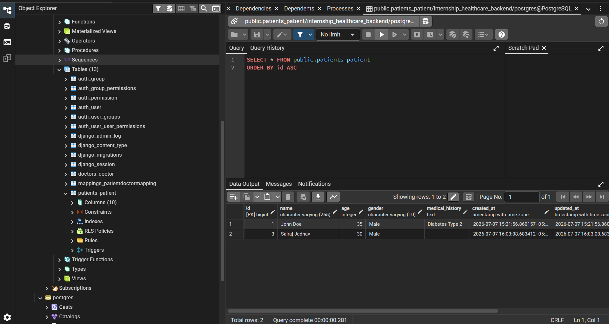

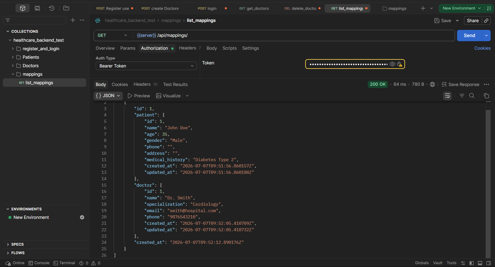

---

If you'd like different captions or a smaller subset, tell me which filenames to include or how to rename them and I'll update the file.
